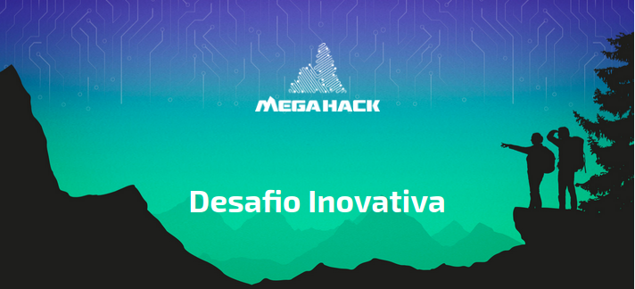

# MegaHack 5.0 Desafio Inovativa



Projeto para o [MegaHack 5.0](https://www.megahack.com.br/) realizado entre 09
e 15 de novembro de 2020. 

## O que é o Mega Hack

O maior hackathon on-line do Brasil não poderia carregar outro nome, senão: MEGA!

Grande não apenas por quebrar barreiras geográficas, mas também pela dimensão da
jornada que proporciona aos seus participantes. O Mega Hack é o Monte Everest dos
hackathons, e é preciso preparo para chegar ao topo.

## O desafio

Como auxiliar o Programa Inovativa Brasil a chegar em mais pessoas, de diferentes
regiões do país, interiorizando assim o acesso à inovação e conhecimento?

Nos seguintes pilares:
- Como aumentar o relacionamento e engajamento online de comunidades locais em
  diferentes estágios de maturidade?
- Como otimizar a gestão e estratégia para plataformas colaborativas de conteúdo?
- Como fomentar de forma prática ecossistemas incipientes sem cultura de
  empreendedorismo disseminada?
- Como fomentar mentores/as e investidores/as fora dos grandes centros?
- Como regionalizar conteúdos e ações nacionais?

## A solução

Transformar a jornada de preparação para aceleração com a Inovativa em uma
experiência agradável e lúdica. Apresentando uma lista de desafios que devem ser
superados usando elementos gráficos de gamificação e oferecendo recursos/materiais
para auxiliar em cada etapa.

Solução desenvolvida com [ReactJs](https://reactjs.org/).

## Executando o projeto

```
yarn install
yarn start
```
